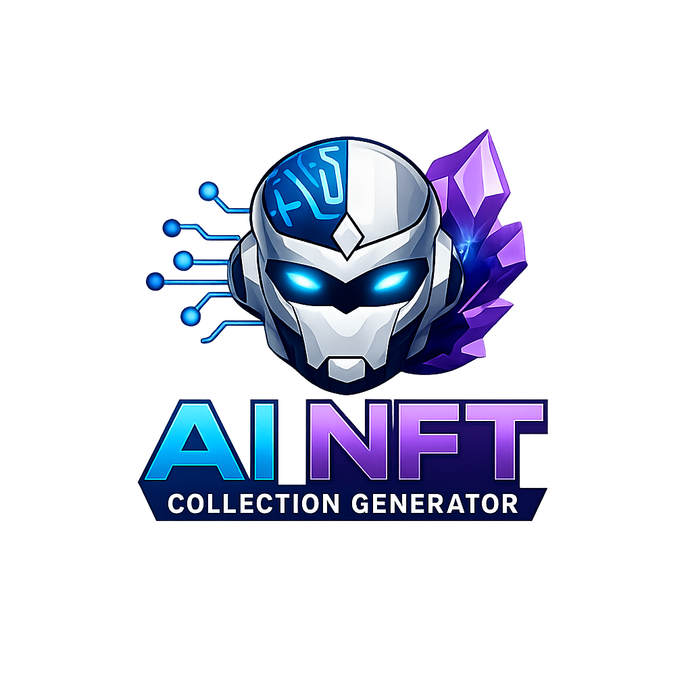

<div align="center">



# AI NFT Collection Generator

**Enterprise-grade AI pipeline for launching production-ready NFT collections from a single creative brief.**

[](https://nextjs.org)
[](https://react.dev)
[](https://typescriptlang.org)
[](https://tailwindcss.com)
[](https://hardhat.org)
[](LICENSE)

[Live Demo](https://adrijan-petek.github.io/AI-NFT-Collection-Generator/) · [API Docs](/api-docs) · [Deployment Guide](DEPLOYMENT.md)

</div>

---

## Overview

AI NFT Collection Generator replaces fragmented NFT tooling with a single studio that takes you from a plain-language creative brief to a fully deployable collection — traits, rarity, metadata, smart contract, and mint site — in minutes.

| Capability | Details |
|---|---|
| **Collection planning** | AI-derived concept, narrative, utility copy, and trait architecture |
| **Rarity engine** | Weighted distributions, scarcity tiers (common → legendary), duplicate suppression |
| **Metadata export** | OpenSea-compatible JSON with normalized `attributes[]` and collection references |
| **Contract generation** | ERC-721A Solidity source, audited-ready, Hardhat 3 compilation |
| **Mint site scaffold** | Deployable HTML with wallet connect and optional payment gating |
| **IPFS pipeline** | One-click Pinata upload for metadata and preview assets |
| **Preview rendering** | First 20 NFTs generated instantly per run |

---

## Tech Stack

| Layer | Technology |
|---|---|
| **Frontend** | Next.js 16, React 19, Tailwind CSS 4, TypeScript 5 |
| **Backend** | Next.js App Router API routes, Zod validation |
| **Database** | PostgreSQL · Prisma ORM |
| **Auth** | Clerk (graceful no-op when unconfigured) |
| **Payments** | OpenSea ERC-8257 onchain tool gating · Stripe fallback |
| **Storage** | Pinata IPFS |
| **Blockchain** | Solidity 0.8.24 · OpenZeppelin · ERC721A · Hardhat 3 |
| **Wallet** | RainbowKit · Wagmi · viem (Base, Ethereum, Polygon) |
| **Testing** | Vitest |
| **Infra** | Docker · docker-compose |

---

## Project Structure

```
src/
├── app/                    # Next.js App Router pages and API routes
│   ├── page.tsx            # Landing page
│   ├── dashboard/          # Authenticated project dashboard
│   ├── admin/              # Admin analytics panel
│   ├── api-docs/           # Endpoint reference
│   └── api/
│       ├── generate/       # Core AI generation endpoint
│       ├── projects/       # Project CRUD
│       ├── contracts/      # ERC-721A contract generation
│       ├── mint-site/      # Mint page generation
│       ├── ipfs/           # Pinata upload
│       ├── billing/        # Stripe checkout
│       └── pro/            # Onchain access gate
├── components/
│   ├── landing/            # Hero, sections
│   ├── dashboard/          # Project UI panels
│   ├── navigation.tsx
│   └── ui/                 # Button, GlassCard primitives
├── lib/
│   ├── ai/                 # Collection engine, rarity, duplicate detector
│   ├── blockchain/         # Contract templates
│   ├── ipfs/               # Pinata client
│   ├── mint-site/          # HTML template
│   ├── onchain/            # OpenSea tool registry
│   └── validations/        # Zod schemas
├── proxy.ts                # Next.js 16 request proxy (auth guard)
contracts/
└── AINFTCollection.sol     # ERC-721A production contract
prisma/
├── schema.prisma
└── seed.ts
```

---

## Quick Start

> For full production go-live instructions see [`DEPLOYMENT.md`](DEPLOYMENT.md).

**1. Install dependencies**

```bash
npm install
```

**2. Configure environment**

```bash
cp .env.example .env
```

Edit `.env` and fill in:

| Variable | Purpose |
|---|---|
| `DATABASE_URL` | PostgreSQL connection string |
| `NEXT_PUBLIC_CLERK_PUBLISHABLE_KEY` | Clerk auth (optional for local dev) |
| `CLERK_SECRET_KEY` | Clerk auth (optional for local dev) |
| `STRIPE_SECRET_KEY` | Stripe billing |
| `STRIPE_WEBHOOK_SECRET` | Stripe webhook verification |
| `STRIPE_PRICE_PRO_MONTHLY` | Stripe price ID for Pro plan |
| `PINATA_JWT` | Pinata IPFS JWT |
| `AI_PROVIDER` | `openai` or compatible |
| `AI_API_KEY` | AI provider key |
| `OPENSEA_TOOL_ENDPOINT` | Public HTTPS endpoint for onchain tool registry |
| `OPENSEA_TOOL_OWNER` | Wallet address that owns the registered tool |
| `PRO_NFT_GATE` | NFT contract address for Pro access gate |
| `PRO_TOKEN_GATE` | ERC-20 token address for Pro access gate |
| `PRO_PAY_PER_CALL_WEI` | Per-call price in wei (0 = free) |

**3. Initialize database**

```bash
npm run prisma:generate
npm run prisma:migrate
npm run seed
```

**4. Start development server**

```bash
npm run dev
```

| URL | Purpose |
|---|---|
| http://localhost:3000 | Landing page |
| http://localhost:3000/dashboard | Project creation and generation |
| http://localhost:3000/admin | Admin analytics |
| http://localhost:3000/api-docs | API endpoint reference |

---

## Generation Workflow

```
User prompt
    │
    ▼
POST /api/projects          ← Create project record
    │
    ▼
POST /api/generate          ← AI collection engine
    │                            - Parse brief
    │                            - Build trait architecture
    │                            - Apply rarity weights
    │                            - Run duplicate checks
    │                            - Generate preview metadata (20 items)
    ▼
POST /api/contracts/generate ← Compile ERC-721A Solidity source
POST /api/mint-site/generate ← Scaffold deployable mint HTML
POST /api/ipfs/upload        ← Pin metadata to Pinata IPFS
```

> For collections over 25 NFTs, `/api/generate` first validates onchain wallet access via the ERC-8257 tool registry on Base. Stripe checkout is available as a fallback billing path.

---

## Onchain Access Gating (OpenSea ERC-8257)

```bash
# 1. Install OpenSea skill
npx skills add ProjectOpenSea/opensea-skill

# 2. Generate registration payload
npm run opensea:payload

# 3. Register on Base
# Prompt your agent: "Use the opensea-tool-sdk skill to register my tool onchain on Base."
```

Configure gating policy in `.env`:
- `PRO_NFT_GATE` — require ownership of a specific NFT collection
- `PRO_TOKEN_GATE` — require a minimum ERC-20 token balance
- `PRO_PAY_PER_CALL_WEI` — charge per generation call in wei

---

## Smart Contract

The generated contract (`contracts/AINFTCollection.sol`) extends **ERC-721A** with:
- Batch minting optimized for low gas at scale
- OpenZeppelin `Ownable` and `Pausable`
- ERC-2981 royalty standard
- Configurable public and allowlist mint phases

```bash
# Compile contracts
npm run hardhat:compile
```

---

## Marketplace Compatibility

Metadata follows OpenSea standards and is compatible with:

| Marketplace | Chain support |
|---|---|
| OpenSea | Base, Ethereum, Polygon |
| Blur | Ethereum |
| Magic Eden | Base, Polygon |

Metadata structure per token:

```json
{
  "name": "Collection Name #1",
  "description": "...",
  "image": "ipfs://...",
  "attributes": [
    { "trait_type": "Background", "value": "Holographic" },
    { "trait_type": "Eyes",       "value": "Laser",        "rarity": "legendary" }
  ]
}
```

---

## Docker

```bash
docker compose up --build
```

Includes PostgreSQL, Next.js app, and Prisma migration runner.

---

## GitHub Pages (Static Demo)

A static demo page is published automatically on every push to `main` via GitHub Actions.

**Enable Pages:**
1. Go to **Settings → Pages**
2. Set **Source** to **GitHub Actions**
3. Push to `main`

Published at: `https://Adrijan-Petek.github.io/AI-NFT-Collection-Generator/`

---

## Available Scripts

| Command | Purpose |
|---|---|
| `npm run dev` | Start development server |
| `npm run build` | Production build |
| `npm run lint` | ESLint |
| `npm run test` | Run Vitest unit tests |
| `npm run prisma:generate` | Regenerate Prisma client |
| `npm run prisma:migrate` | Run database migrations |
| `npm run prisma:studio` | Open Prisma Studio |
| `npm run seed` | Seed database with initial data |
| `npm run hardhat:compile` | Compile Solidity contracts |
| `npm run opensea:payload` | Generate OpenSea tool registration payload |

---

## Security

- All protected routes validated via Clerk proxy guard (`src/proxy.ts`)
- Environment variables validated with Zod at startup (`src/lib/env.ts`)
- Clerk auth gracefully disabled when keys are placeholder/missing — no runtime crash
- Stripe webhook signature verified server-side before processing
- No private keys committed — `PRIVATE_KEY` loaded from `.env` only for Hardhat tasks
- OWASP Top 10 considered across all API route handlers

---

## Roadmap

- [x] SaaS landing page with glassmorphism dark theme
- [x] Authenticated dashboard — create, list, delete, duplicate, continue projects
- [x] AI collection engine — traits, rarity, duplicate detection
- [x] Metadata and export pipelines — IPFS, contract, mint site
- [x] Admin analytics endpoint and panel
- [x] Unit test suite (Vitest)
- [x] Docker and docker-compose setup
- [x] Next.js 16 proxy convention migration
- [x] Hardhat 3 contract toolchain
- [ ] Real image generation provider integration (Replicate / Stable Diffusion)
- [ ] Queue workers for 10k-scale batch rendering
- [ ] Allowlist / merkle tree phase support in generated contracts
- [ ] Multi-chain deploy wizard

---

## License

MIT © [Adrijan Petek](https://github.com/Adrijan-Petek)
